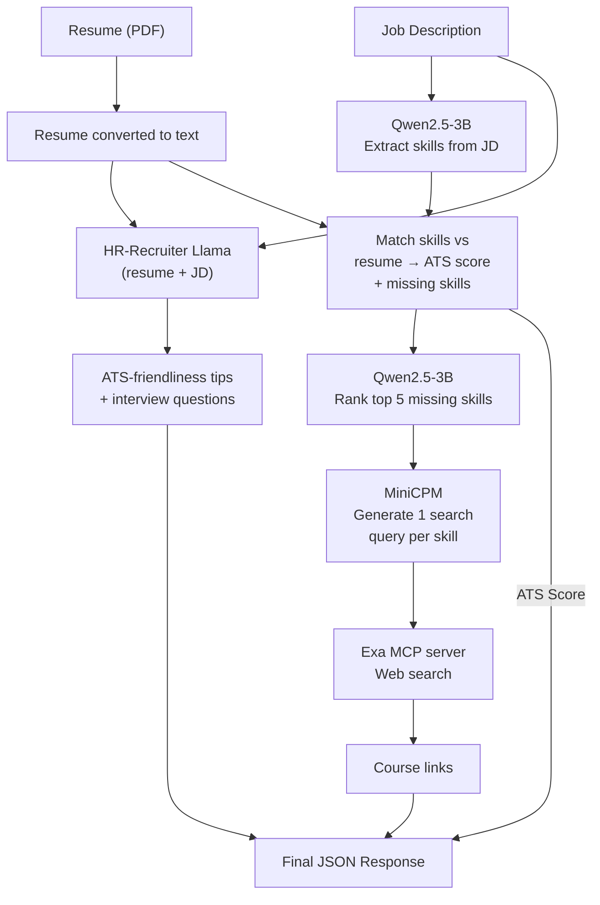

# AI-Resume-Screener
A simple web application that takes in a Resume and a Job description, and returns an ATS score to show you how well your profile meets the job. It also gives you tips on how to make the resume more ATS friendly, potential technical interview questions, major missing skills and also provides you course links where you can learn them.

Upload a resume (PDF) and paste a job description, and the app returns:
- An **ATS score** — how many of the job's required skills your resume actually shows
- The **top missing skills**, ranked by importance to the role
- Tips to make the resume more **ATS-friendly**
- **Likely technical interview questions** for the role
- **Course links** to learn each major missing skill

## How It Works



1. The resume (PDF) is converted to text, and the JD is taken as plain text.
2. **Qwen2.5-3B** reads the JD and extracts every skill/tool/technology mentioned.
3. Python checks each extracted skill against the resume text (with normalization — see below) to get **matching** and **missing** skills, and computes the ATS score.
4. If there are more than 5 missing skills, Qwen is called again to pick the **5 most important** ones, favoring skills the JD marks as required/essential.
5. **HR-Recruiter-Llama-3.1-8B** (a fine-tuned model) separately reads the resume + JD and generates ATS-friendliness tips and 5 potential technical interview questions.
6. **MiniCPM** takes the top 5 missing skills and generates one search query per skill.
7. Those queries are sent to **Exa's MCP server** (real web search, via MCP), and up to 2 course links per skill are returned.
8. All outputs are combined into one JSON response for the frontend.

## ATS Score Calculation

```
ATS Score = (Matched skills in resume) / (Total skills identified in JD) × 100
```

- Skills are normalized before comparing (e.g. `scikit-learn` / `sklearn`, `SQL` / `MySQL` / `PostgreSQL`, `JS` / `JavaScript` are treated as equivalent), filler words like "basic understanding of" are stripped, and combined phrases like "TensorFlow or PyTorch" are split into separate skills.
- A keyword-based safety net (a curated list of ~100 common tech/business skills) catches anything the model might have missed from the JD.
- Soft skills (communication, teamwork, leadership, etc.) are excluded from scoring since they can't be reliably keyword-matched.
- If fewer than 3 total skills are detected, no score is returned, to avoid a misleading number from too little data.

## MCP Integration (Exa Web Search)

The course-recommendation step uses the **Model Context Protocol (MCP)**. MiniCPM is given a tool definition for `web_search_exa` and outputs one intended search query per missing skill. The app parses these queries out of the model's output, then makes the actual tool calls through a real MCP client session connected to **Exa's remote MCP server** — running all the skill searches concurrently for speed, and giving at max 2 links per skill.

## Technical Constraints & Design Choices

- **Hardware constraint**: only 4GB of VRAM was available, so all three models could not be loaded at once. The app uses **lazy loading** — each model is loaded onto the GPU, used, and unloaded before the next one starts.
- **GGUF quantization** (via llama.cpp) was used for Qwen and the 8B HR-Recruiter model, since the full-precision HR model was too large to fit in VRAM or store locally.
- **MiniCPM** uses standard `bitsandbytes` 4-bit quantization through `transformers` instead, since it's small enough to run that way.
- Because models are loaded/unloaded sequentially rather than kept resident, a full analysis takes **a few minutes** end-to-end.

## Limitations

- Slower than a typical API-based tool due to sequential model loading on limited hardware.
- Keyword/normalization-based skill matching can still miss skills phrased very differently from the JD.
- The "major missing skills" ranking depends on a second LLM call; if it fails, it silently falls back to the first 5 missing skills found.
- The MiniCPM model is unable to give course links for few skills sometimes.

## Setup

1. Clone the repo and install dependencies:
```bash
   git clone https://github.com/Bhavya-Motiyani/AI-Resume-Screener.git
   cd AI-Resume-Screener
   pip install -r requirements.txt
```
2. Download the [llama.cpp Windows CUDA build](https://github.com/ggml-org/llama.cpp/releases) and extract it into a `llama_bin/` folder in the project root, so that `llama_bin/llama-server.exe` exists.
3. Run the app:
```bash
   python app.py
```
   The GGUF models (~7GB total) will auto-download on first run. The app will then be available at `http://127.0.0.1:5000`.

## Author

**Bhavya Motiyani**
B.Tech in Computer Science and Engineering (Data Science)
Gujarat Technological University — VGEC

📧 bhavyamotiyani68@gmail.com
🔗 [LinkedIn Profile](https://www.linkedin.com/in/bhavyamotiyani-059544306)
